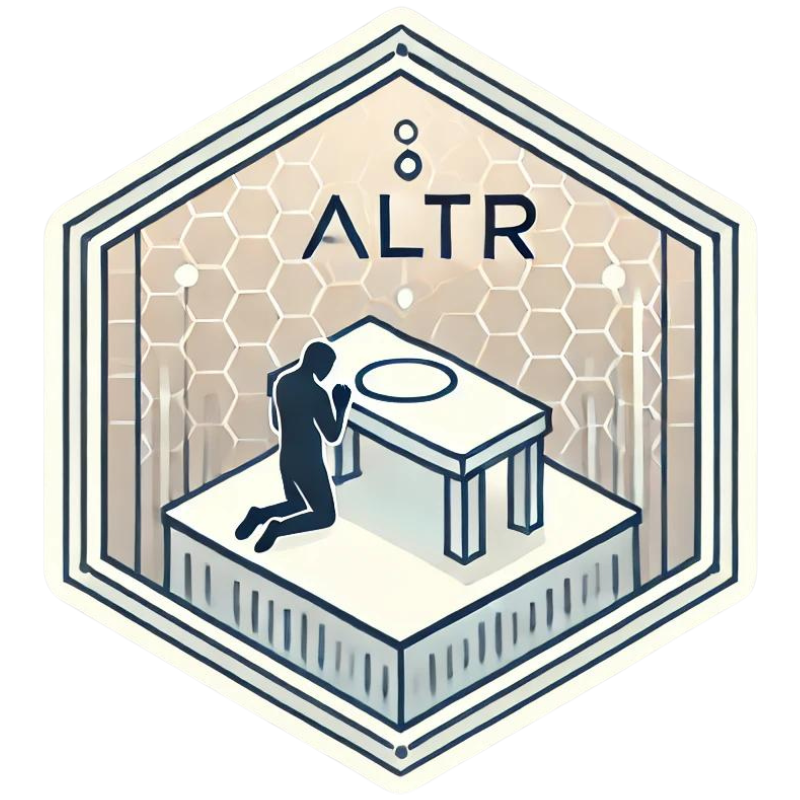
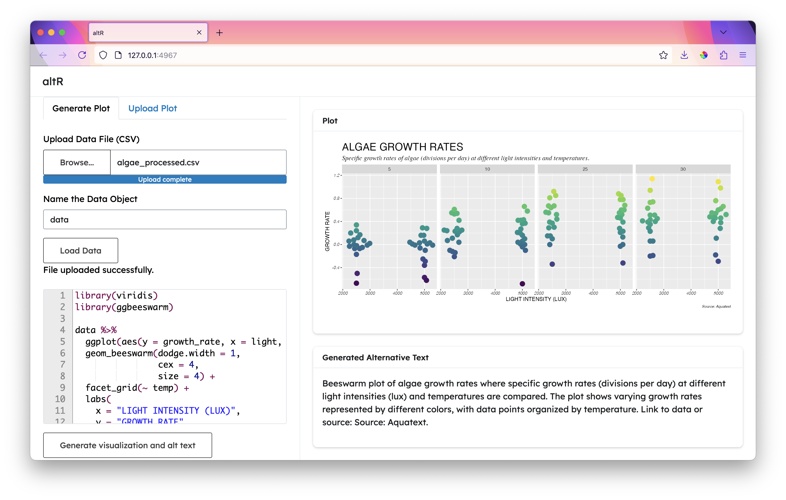

# altR 

## R Plot Alternative Text Generator

This Shiny app uses GPT-4o-mini to generate alternative text for R plots made with base R or ggplot2.

 

## Example plots

Try out the data upload/generate alt text feature:

1. Upload `examples/algae_process.csv`
2. Paste the code from `algae_plot.R` in the text box

Try out the image upload/generate alt text feature:

1. `examples/exampleplot.png` from the {ggstats} package: <https://larmarange.github.io/ggstats/articles/gglikert.html>
2. `examples/exampleplot2.png` from Nicola Rennie: <https://nrennie.rbind.io/projects/data-visualisation/>